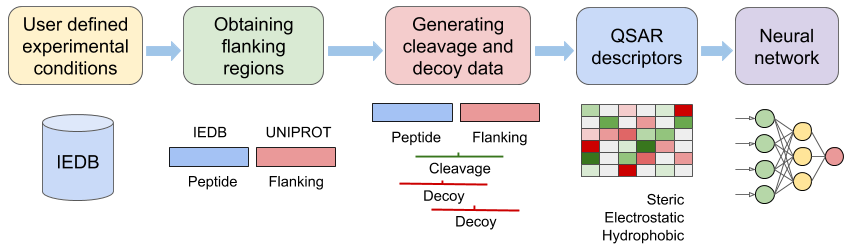

# NetCleave

NetCleave is a retrainable method for predicting C-terminal peptide processing of MHC-I and MHC-II pathways.

In brief, NetCleave maps reported IEDB peptides to protein sequences in UniProt/UniParc. After the identification of the C-terminal cleavage site, amino acid sequences are coded using QSAR descriptors, including steric, electrostatic and hydrophobic properties. Finally, a neural network architecture is used to generate the predictive model.

If you use NetCleave, please cite us:

> 
 Amengual-Rigo, P., Guallar, V. NetCleave: an open-source algorithm for predicting C-terminal antigen processing for MHC-I and MHC-II. Sci Rep 11, 13126 (2021). https://doi.org/10.1038/s41598-021-92632-y

NetCleave has the following dependencies:

- [argparse](https://docs.python.org/3/library/argparse.html)
- [pandas](https://pandas.pydata.org/)
- [numpy](https://numpy.org/)
- [matplotlib](https://matplotlib.org/)
- [pathlib](https://docs.python.org/3/library/pathlib.html)
- [sklearn](https://scikit-learn.org/stable/)
- [keras](https://keras.io/)
- [tensorflow](https://www.tensorflow.org/)

## How to use NetCleave

NetCleave is very easy to use. It has three main functions:

- **generate** - gets C-terminal data from IEDB and UniProt/UniParc.
- **train** - runs the neural network and saves weights.
- **predict_csv** - scores C-terminal sites from a csv file.

Users can choose between using NetCleave **pre-trained models** or **easily retraining them**.

### Using pre-trained models

In order to use NetCleave, user needs to define a few parameters:

- HLA class of interest
> Either I or II - **mhc_class variable on NetCleave main function**.
- HLA family of interest
> 
 Several pre-trained models are available, which should cover most of the needs of the scientific community. This includes models for *HLA-A*, *HLA-B*, *HLA-C*, *HLA-DP*, *HLA-DQ*, *HLA-DP*, *H2-Kb*, *H2-Db*, *HLA-A02:01*, *HLA-B07:02*, and others. Check data/models folder - **mhc_family variable on NetCleave main function**.

NetCleave can predict the cleavage probability of a C-terminal site, which we defined as:

> **Four (4) last amino acids of a peptide + three (3) following amino acids in sequence**

User needs to define **a sequence of seven (7) residues lenght** following the previous scheme, and add them into a csv file (column name: "sequence"). An example can be found on the "*example_file_NetCleave_score.csv*" file. The command to score cvs files is the following:

> python3 NetCleave.py --score_csv

After running this command, a csv file with the results will be generated.

### Retraining the method and constructing your own models

NetCleave was specificaly designed to be easily retrained. In order to do so, user needs:

- Decompress or obtain databases
> IEDB - data/databases/iedb folder. New versions may be found at: http://www.iedb.org/database_export_v3.php

> UniProt/UniParc - data/databases/uniprot and data/databases/uniparc folders. New versions may be found at: https://www.uniprot.org/downloads

**We recomend to use the last version of IEDB while keeping the same UniProt/UniParc version that we provided in this repository**

- Define IEDB, UniProt and UniParc file paths on NetCleave main function
- Define HLA class and HLA family of interest, as detailed in the previous section
- Execute the following command:
> python3 NetCleave --generate --train

After running this command, NetCleave will parse IEDB and UniProt/UniParc information and will run the neural network to generate a predictive model. Live statistics will be displayed on the screen, and weights will be saved automatically. In addition, a plot consisting on the training and testing loss performance will be saved.

> 
 User should check the quality of the model. If the loss performance between the training and testing groups differ substantially or if there is any sign of overfitting, the user should modify predictor/ml_main/run_netcleave_neural_network.py script. Usually, this phenomena happens because a very small dataset is used (a few peptides), which is not enough for building a high quality model. If this happens, consider to generate a more general model (for instance, instead of HLA-A0201, use HLA-A02 or HLA-A).

